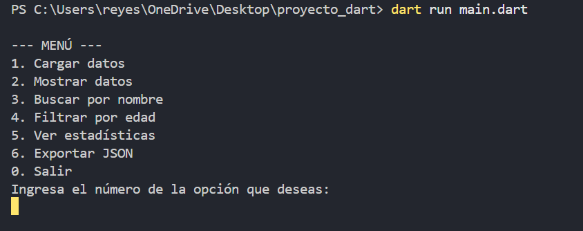
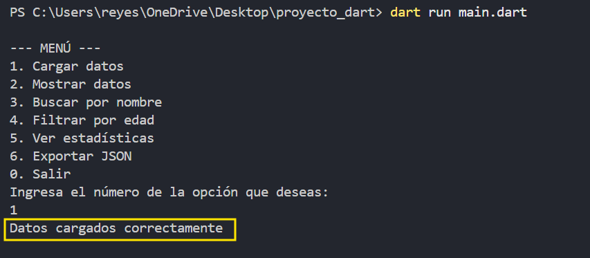
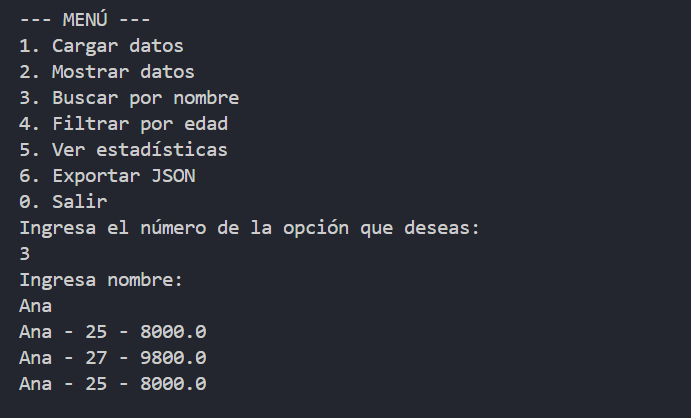
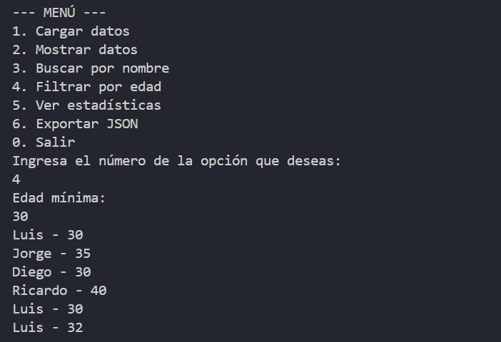
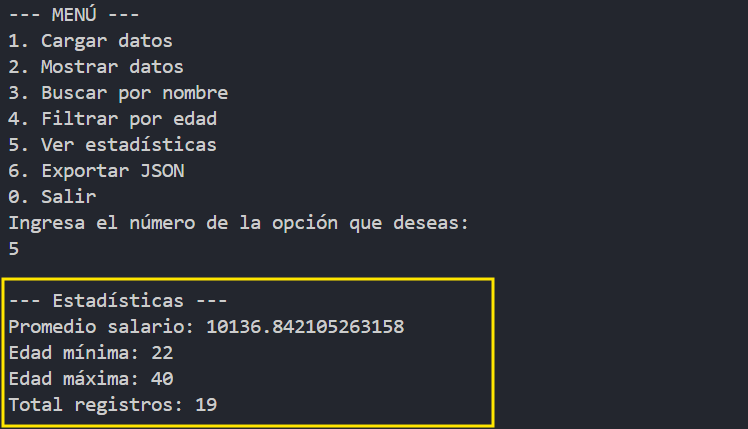

# 📊 Proyecto_01 : Análisis de Datos con Dart

---

## 📌 Descripción del proyecto

Este proyecto consiste en el desarrollo de una aplicación de consola utilizando Dart para analizar información almacenada en archivos JSON. La aplicación permite cargar registros, realizar búsquedas, aplicar filtros, generar estadísticas básicas y exportar los resultados obtenidos a un nuevo archivo.

---

## 📌 Objetivo del proyecto

Desarrollar una aplicación capaz de leer datos desde archivos JSON, procesarlos y mostrar información útil al usuario mediante búsquedas, filtros y estadísticas, aplicando conceptos fundamentales de programación en Dart.

---

## 🧠 Problema que resuelve

Muchas organizaciones y sistemas almacenan información en formato JSON, pero no siempre cuentan con herramientas sencillas para analizar esos datos. Este proyecto resuelve ese problema permitiendo consultar registros, filtrar información específica, obtener estadísticas y exportar resultados de manera rápida desde una aplicación de consola.

---

## 🧰 Tecnologías utilizadas

- Dart: Lenguaje principal utilizado para desarrollar toda la aplicación.

- dart:io: Utilizado para la lectura y escritura de archivos.

- dart:convert: Utilizado para convertir datos JSON a objetos Dart y viceversa.

- Visual Studio Code: Entorno de desarrollo utilizado durante la implementación.

- JSON: Formato empleado para almacenar la información.

- GitHub: Control de versiones y almacenamiento del proyecto.

---

## 📚 Conceptos aplicados

- Programación orientada a objetos: Utilicé clases para representar cada registro del archivo JSON.

- Clases y objetos: Permitieron organizar los datos de manera estructurada.

- Manejo de archivos: Utilicé lectura y escritura de archivos JSON.

- Conversión JSON: Implementé métodos para convertir datos JSON en objetos y viceversa.

- Funciones: Utilizadas para separar y organizar las diferentes operaciones del programa.

- Listas y colecciones: Permitieron almacenar y procesar múltiples registros.

- Filtros y búsquedas: Aplicados para localizar información específica.

- Estadísticas básicas: Utilizadas para calcular promedios, edades mínimas y máximas.

- Menús interactivos: Permitieron la interacción del usuario mediante consola.

- Null Safety: Utilizado para mejorar la seguridad y estabilidad del código.

---

## 🎮 Funcionalidades principales

- Carga de datos desde archivos JSON.

- Búsqueda de registros por nombre.

- Filtrado de registros por edad mínima.

- Cálculo de estadísticas básicas.

- Exportación de resultados a un nuevo archivo JSON.

- Menú interactivo en consola.

- Conversión automática entre JSON y objetos Dart.

---

## 📸 Evidencias

### Menú principal


### Carga de datos


### Búsqueda por nombre


### Filtrado por edad


### Estadísticas generadas


### Exportación de datos


---

## 🚀 Instrucciones de ejecución

1. Descargar o clonar el proyecto en tu computadora.

```bash
git clone <URL_DEL_REPOSITORIO>
```

2. Abrir la carpeta del proyecto en Visual Studio Code.

3. Verificar que Dart esté instalado correctamente ejecutando en la terminal:

```bash
dart --version
```

4. Ubicarse en la carpeta donde se encuentra el archivo principal.

```bash
cd codigo
```

5. Ejecutar la aplicación mediante:

```bash
dart run main.dart
```

6. Utilizar las opciones del menú para realizar búsquedas, filtros, generar estadísticas y exportar datos.

---

## 📈 Resultados Obtenidos

Se desarrolló una aplicación funcional capaz de cargar información desde archivos JSON y procesarla correctamente. El sistema permite realizar búsquedas por nombre, aplicar filtros por edad, generar estadísticas básicas y exportar los resultados obtenidos. Además, se implementó una estructura organizada basada en clases y objetos que facilita el mantenimiento y escalabilidad del proyecto.

---

## 💭 Reflexión Personal

### ¿Qué aprendí?

Aprendí a trabajar con archivos JSON en Dart, convertir datos entre formatos, utilizar clases para representar información, implementar búsquedas y filtros, generar estadísticas y desarrollar aplicaciones de consola interactivas.

### ¿Qué fue difícil?

Uno de los principales desafíos fue comprender el proceso de lectura y conversión de archivos JSON a objetos Dart. También fue necesario organizar correctamente las funciones para mantener un código claro y fácil de mantener.

### ¿Qué mejoraría?

Me gustaría agregar una interfaz gráfica para facilitar la interacción del usuario, incluir gráficos estadísticos para visualizar los datos de forma más intuitiva y ampliar las opciones de filtrado y análisis disponibles.
