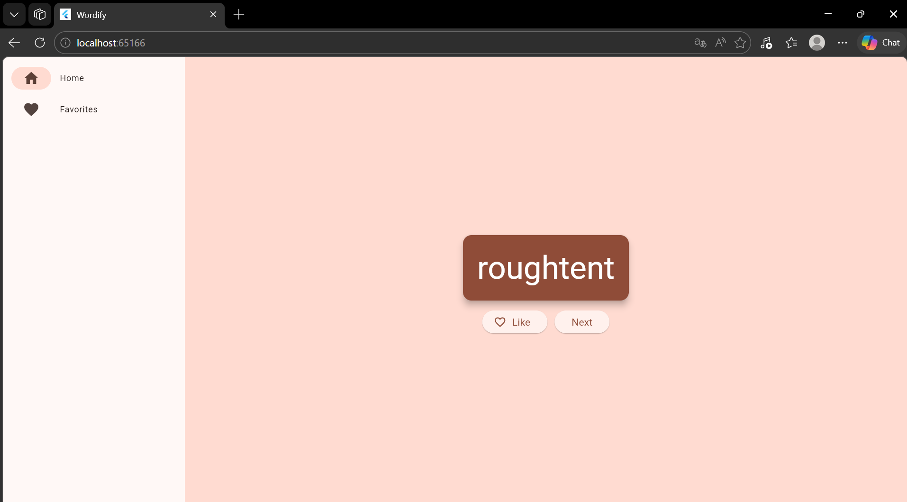

# 💡 Proyecto: Generador de Ideas en Flutter 

---

## 📌 Descripción del proyecto

Este proyecto consiste en el desarrollo de una aplicación multiplataforma (ejecutada en entorno web) utilizando Flutter.  La aplicación genera de manera dinámica combinaciones de palabras aleatorias en inglés, permitiendo al usuario visualizarlas a través de una interfaz moderna, marcarlas como favoritas y gestionarlas desde una sección dedicada mediante un menú de navegación interactivo.

---

## 📌 Objetivo del proyecto

Comprender el funcionamiento práctico de la creación de interfaces de usuario, el manejo del estado global y la navegación entre pantallas independientes utilizando el framework Flutter.

---

## 🧠 Problema que resuelve

Muchas aplicaciones de ejemplo iniciales se limitan a interfaces estáticas o locales sin interactividad real. Este proyecto resuelve ese problema al implementar una lógica reactiva donde las propuestas de palabras se generan en tiempo real y el estado de los "favoritos" se comparte y preserva entre pantallas de forma dinámica sin perder la información durante la navegación.

---

## 🧰 Tecnologías utilizadas

- Flutter: Framework principal para el desarrollo de la interfaz gráfica y la estructura web de la app
  
- Dart: Lenguaje de programación utilizado para toda la lógica de negocio y comportamiento de los widgets
  
- Visual Studio Code / Windows PowerShell: Entorno de desarrollo integrado y terminal para la ejecución de comandos de Flutter
  
- english_words: Librería/paquete externo utilizado para proveer el diccionario y la generación de combinaciones aleatorias
    
- provider: Paquete encargado de la gestión de estados para compartir y actualizar los datos entre componentes de manera eficiente
  
- Microsoft Edge: Navegador web utilizado como dispositivo de prueba para compilar y validar la aplicación a través de Flutter Web  

---

## 📚 Conceptos aplicados

- ChangeNotifier & Provider: Los utilicé en la clase `MyAppState` para almacenar la palabra actual y la lista de favoritas, notificando automáticamente a la interfaz ante cualquier cambio en los datos.
  
- StatefulWidget y StatelessWidget: Los apliqué estratégicamente; la pantalla principal se definió con estado para controlar el índice de navegación, mientras que componentes como las tarjetas de palabras se mantuvieron sin estado.
  
- Estructura Switch para Navegación: La utilicé para alternar dinámicamente el renderizado de la pantalla central basándose en la opción activa del menú lateral.
  
- LayoutBuilder & Scaffold: Los utilicé para organizar de manera responsiva la estructura visual, permitiendo extender o contraer el menú lateral según las dimensiones de la pantalla.
  
- NavigationRail: Lo utilicé para construir un menú de navegación lateral moderno con accesos directos a 'Home' y 'Favorites'.
  
- ListView y ListTile: Los utilicé para iterar y desplegar de forma limpia y ordenada la colección de palabras agregadas a favoritos.
  
- Personalización del Linter (analysis_options.yaml): Lo apliqué para flexibilizar las reglas de desarrollo iniciales, facilitando el aprendizaje continuo del flujo del framework.

---

## 🎮 Funcionalidades principales

- Generador ilimitado de combinaciones de palabras aleatorias en inglés  
- Sistema de favoritos (Like) con iconos dinámicos y adaptativos  
- Menú lateral interactivo para navegación fluida entre pantallas  
- Diseño responsivo que se adapta automáticamente al tamaño del navegador web  
- Visualización de palabras destacadas en tarjetas estilizadas (BigCard) usando los colores del tema  
- Validación automática de contenido con alertas visuales ("No hay favoritos todavía") si la lista se encuentra vacía  

---

## 📸 Evidencias

### Pantalla principal (GeneratorPage)


### Generación de palabras


### Guardado de favoritos (Botón Like)


### Apartado de tus favoritos (FavoritesPage)


---

## 🚀 Instrucciones de ejecución

1. Descargar o clonar la carpeta del proyecto `generador_ideas` en tu computadora.  

2. Abrir la carpeta del proyecto en **Visual Studio Code**.  

3. Verificar que Flutter esté instalado correctamente ejecutando en la terminal:  

```bash
flutter doctor
