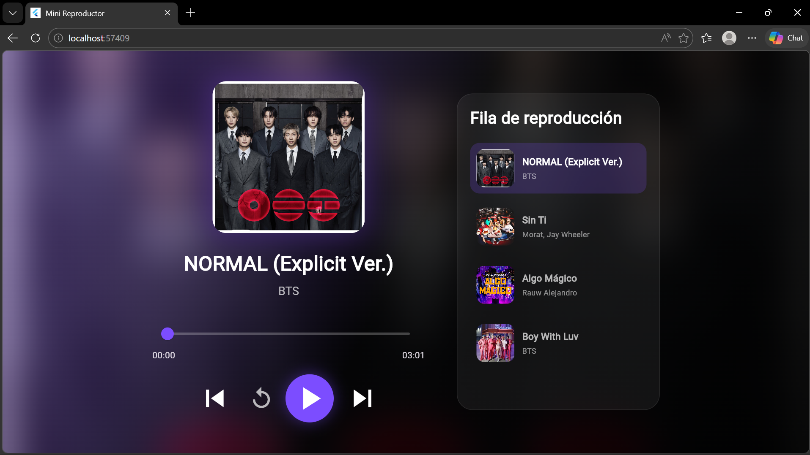
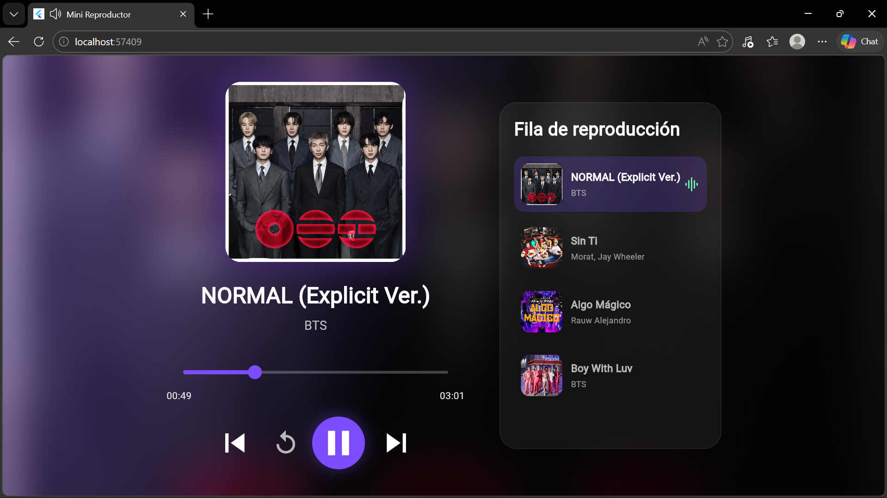
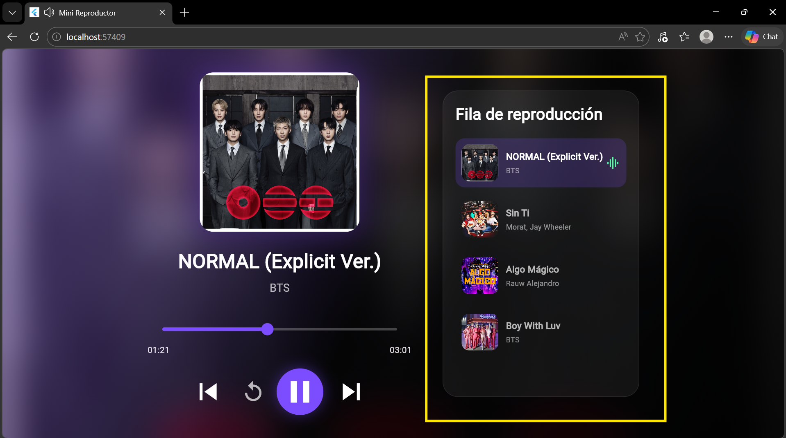
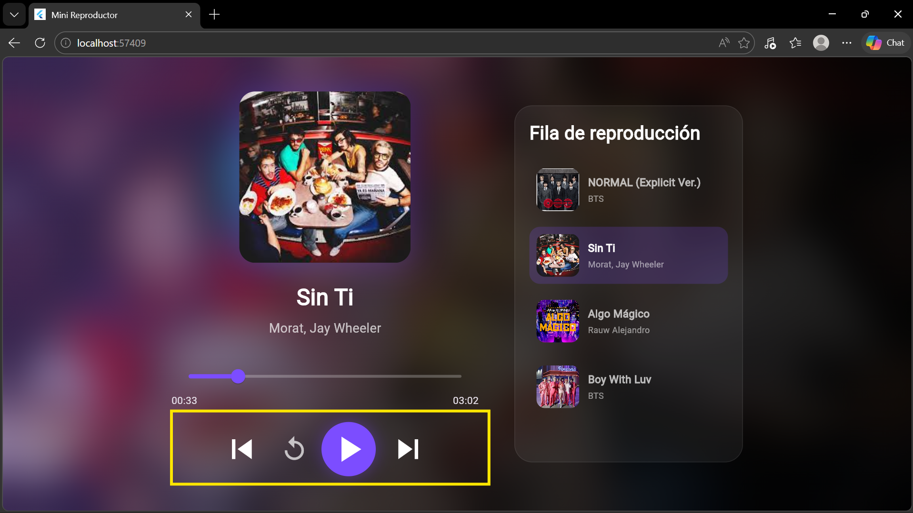

# 🎵 Proyecto 3: Mini Reproductor de Música en Flutter

---

## 📌 Descripción del proyecto

Este proyecto consiste en el desarrollo de una aplicación móvil de reproductor de música utilizando Flutter.  
La aplicación permite reproducir canciones almacenadas localmente, con una interfaz moderna e interactiva que incluye controles de reproducción, lista de canciones y efectos visuales.

---

## 📌 Objetivo del proyecto

Desarrollar una aplicación móvil capaz de reproducir archivos de audio utilizando Flutter, implementando una interfaz moderna e interactiva que permita al usuario controlar la reproducción de canciones de manera sencilla.

---

## 🧠 Problema que resuelve

Muchas aplicaciones de ejemplo únicamente muestran una interfaz visual sin funcionalidades reales. Este proyecto resuelve ese problema al permitir la reproducción real de música, brindando controles para reproducir, pausar, reiniciar y cambiar canciones, además de mostrar información de la pista actual y su progreso de reproducción.

---

## 🧰 Tecnologías utilizadas

- Flutter: Desarrollo de la interfaz gráfica y estructura de la app  
- Dart: Lenguaje principal para la lógica del reproductor  
- Visual Studio Code: Entorno de desarrollo  
- just_audio: Reproducción de audio  
- rxdart: Manejo de eventos y flujos de datos  
- GitHub: Control de versiones y respaldo del proyecto  

---

## 📚 Conceptos aplicados

- Programación orientada a objetos: La utilicé para organizar el código mediante clases y objetos.
- StatefulWidget: Lo utilicé para actualizar la interfaz cuando cambia la canción o el estado de reproducción.  
- Manejo de estados: Permitió reflejar en pantalla los cambios que ocurren durante la reproducción.  
- Assets: Los utilicé para almacenar y cargar imágenes y archivos de audio.  
- ListView.builder: Lo utilicé para generar automáticamente la lista de canciones.  
- Slider: Permitió mostrar y controlar el avance de la canción.  
- ImageFilter.blur: Lo utilicé para crear el efecto de fondo borroso y mejorar el diseño visual.  
- Manejo de eventos: Lo apliqué para responder a las acciones del usuario sobre los botones del reproductor.  

---

## 🎮 Funcionalidades principales

- Reproducción de canciones MP3  
- Pausar y reanudar música  
- Reiniciar canción  
- Siguiente y anterior canción  
- Lista de reproducción interactiva  
- Barra de progreso en tiempo real  
- Portadas de canciones  
- Fondo dinámico con efecto blur  
- Cambio automático de canción  

---

## 📸 Evidencias

### Pantalla principal


### Reproducción de música


### Lista de canciones


### Controles de reproducción


---

## 🚀 Instrucciones de ejecución

1. Descargar o clonar el proyecto en tu computadora.  

2. Abrir la carpeta del proyecto en **Visual Studio Code** o **Android Studio**.  

3. Verificar que Flutter esté instalado correctamente ejecutando en la terminal: 

```bash
flutter doctor
```

4.  Instalar las dependencias ejecutando:

```bash
flutter pub get
```

5. Ejecutar la aplicación mediante:

```bash
flutter run
```

6. Seleccionar una canción de la lista y utilizar los controles para reproducir, pausar, reiniciar o cambiar de pista.

## Resultados Obtenidos

Se desarrolló un reproductor de música completamente funcional que permite reproducir canciones almacenadas localmente dentro de la aplicación. La interfaz muestra la portada, el nombre de la canción, el artista correspondiente y una barra de progreso actualizada en tiempo real. Además, se implementó una lista de reproducción interactiva y un fondo dinámico con efecto de desenfoque que mejora la experiencia visual del usuario

## Reflexión Personal

### ¿Qué aprendí?

Aprendí a utilizar Flutter para crear aplicaciones móviles más completas, integrar paquetes externos para la reproducción de audio y trabajar con recursos multimedia almacenados en la carpeta assets. También reforcé mis conocimientos sobre el manejo de estados y la construcción de interfaces dinámicas

### ¿Qué fue difícil?

Uno de los principales desafíos fue comprender cómo interactúan los diferentes widgets para construir toda la interfaz del reproductor. También fue necesario configurar correctamente los archivos de audio e imágenes para que Flutter pudiera reconocerlos y utilizarlos sin errores.

Aprendí a utilizar Flutter para crear aplicaciones móviles más completas, integrar paquetes externos para la reproducción de audio y trabajar con recursos multimedia almacenados en la carpeta assets. También reforcé mis conocimientos sobre el manejo de estados y la construcción de interfaces dinámicas

### ¿Qué mejoraría?

Me gustaría agregar nuevas funciones como control de volumen, reproducción aleatoria, modo repetición, favoritos y reproducción en segundo plano para ofrecer una experiencia más completa al usuario. También mejoraría el diseño visual agregando más animaciones y opciones de personalización.


